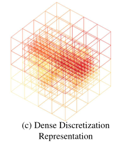
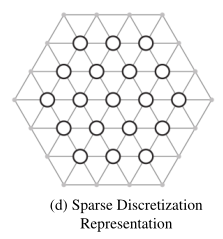

<!-- START doctoc generated TOC please keep comment here to allow auto update -->
<!-- DON'T EDIT THIS SECTION, INSTEAD RE-RUN doctoc TO UPDATE -->
**Table of Contents**  *generated with [DocToc](https://github.com/thlorenz/doctoc)*

- [3D-Point-Cloud-Semantic-Segement Overview](#3d-point-cloud-semantic-segement-overview)
- [1. 3D点云语义分割任务](#1-3d%E7%82%B9%E4%BA%91%E8%AF%AD%E4%B9%89%E5%88%86%E5%89%B2%E4%BB%BB%E5%8A%A1)
  - [1.1 基于投影的方法](#11-%E5%9F%BA%E4%BA%8E%E6%8A%95%E5%BD%B1%E7%9A%84%E6%96%B9%E6%B3%95)
    - [1.1.1 多视图表示](#111-%E5%A4%9A%E8%A7%86%E5%9B%BE%E8%A1%A8%E7%A4%BA)
    - [1.1.2 球形表示(球面投影)](#112-%E7%90%83%E5%BD%A2%E8%A1%A8%E7%A4%BA%E7%90%83%E9%9D%A2%E6%8A%95%E5%BD%B1)
  - [1.2 基于离散化的方法(Discretization-based Methods)](#12-%E5%9F%BA%E4%BA%8E%E7%A6%BB%E6%95%A3%E5%8C%96%E7%9A%84%E6%96%B9%E6%B3%95discretization-based-methods)
    - [1.2.1 密集的离散化表示](#121-%E5%AF%86%E9%9B%86%E7%9A%84%E7%A6%BB%E6%95%A3%E5%8C%96%E8%A1%A8%E7%A4%BA)
    - [1.2.2 稀疏的离散化表示](#122-%E7%A8%80%E7%96%8F%E7%9A%84%E7%A6%BB%E6%95%A3%E5%8C%96%E8%A1%A8%E7%A4%BA)
  - [1.3 混合方法](#13-%E6%B7%B7%E5%90%88%E6%96%B9%E6%B3%95)
  - [1.4 基于点的方法](#14-%E5%9F%BA%E4%BA%8E%E7%82%B9%E7%9A%84%E6%96%B9%E6%B3%95)
    - [1.4.1 逐点的MLP方法](#141-%E9%80%90%E7%82%B9%E7%9A%84mlp%E6%96%B9%E6%B3%95)
      - [临近特征池化](#%E4%B8%B4%E8%BF%91%E7%89%B9%E5%BE%81%E6%B1%A0%E5%8C%96)
      - [基于注意力的聚合](#%E5%9F%BA%E4%BA%8E%E6%B3%A8%E6%84%8F%E5%8A%9B%E7%9A%84%E8%81%9A%E5%90%88)
      - [基于局部-全局特征连接](#%E5%9F%BA%E4%BA%8E%E5%B1%80%E9%83%A8-%E5%85%A8%E5%B1%80%E7%89%B9%E5%BE%81%E8%BF%9E%E6%8E%A5)
    - [1.4.2 点卷积方法](#142-%E7%82%B9%E5%8D%B7%E7%A7%AF%E6%96%B9%E6%B3%95)
    - [1.4.3 基于RNN的方法](#143-%E5%9F%BA%E4%BA%8Ernn%E7%9A%84%E6%96%B9%E6%B3%95)
    - [1.4.4 基于图的方法](#144-%E5%9F%BA%E4%BA%8E%E5%9B%BE%E7%9A%84%E6%96%B9%E6%B3%95)
    - [1.4.5 其它方法](#145-%E5%85%B6%E5%AE%83%E6%96%B9%E6%B3%95)
- [2. 评价指标](#2-%E8%AF%84%E4%BB%B7%E6%8C%87%E6%A0%87)
- [3. 常用Benchmark DataSet](#3-%E5%B8%B8%E7%94%A8benchmark-dataset)
  - [3.1 Public Datasets](#31-public-datasets)
  - [3.2 Benchmark Results](#32-benchmark-results)
- [4. 存在的问题](#4-%E5%AD%98%E5%9C%A8%E7%9A%84%E9%97%AE%E9%A2%98)
- [论文引用](#%E8%AE%BA%E6%96%87%E5%BC%95%E7%94%A8)
- [参考文献](#%E5%8F%82%E8%80%83%E6%96%87%E7%8C%AE)

<!-- END doctoc generated TOC please keep comment here to allow auto update -->

# 3D-Point-Cloud-Semantic-Segement Overview

---

# 1. 3D点云语义分割任务

​		三维点云分割既需要了解全局几何结构，又需要了解每个点的细粒度细节。根据分割粒度的不同，三维点云分割方法可以分为三类:语义分割(场景级)、实例分割(对象级)和部分分割(部分级)。	

​		对于给定的点云，语义分割的目标是根据点的语义意义将其划分为多个子集。与三维形状分类的分类方法类似(第3节)，语义分割有四种范式:基于投影的方法、基于离散的方法、基于点的方法和混合方法。投影和离散的方法的第一步是将点云一个中间正则表示,如多视点[181],[182],球形[183],[184],[185],[166],[186],[187],permutohedral晶格[188],[189],[190]和混合表示,[191]。然后中间分割结果被投影回原始点云。相反，**基于点的方法**直接工作在不规则的点云上。几种典型的方法**如图10**所示。

## 1.1 基于投影的方法

​		这些方法通常将三维点云投影到二维图像中，包括多视图和球形图像。总体而言，多视图分割方法的性能对视点选择和遮挡非常敏感。并且这些方法没有充分利用底层的几何和结构信息，因此投影步骤不可避免地会引入信息损失。与单视图投影相比，球面投影保留了更多的信息，适合于激光雷达点云的标注。但是，此中间表示法不可避免地会带来离散化、误差和遮挡等问题。

### 1.1.1 多视图表示

- Lawin等人的研究成果。[181]首先将3D点云从多个虚拟相机视图投影到2D平面。然后，使用多流FCN对合成图像进行像素级分数预测。通过融合不同视图上的重新投影分数来获得每个点的最终语义标签。
- Boulch等人。[182]首先使用多个相机位置生成点云的多个RGB和深度快照。然后，他们使用2D分割网络对这些快照进行像素级标记。使用残差校正进一步融合从RGB和深度图像预测的分数[192]。
- 基于点云是从局部欧几里得曲面采样的假设，Tatarchenko等人。[193]引入了用于密集点云分割的切线卷积。此方法首先将每个点周围的局部曲面几何体投影到虚拟切线平面。然后直接在曲面几何体上操作切线卷积。该方法具有很强的可扩展性，能够处理几百万个点的大规模点云。

### 1.1.2 球形表示(球面投影)

- 为了实现三维点云的快速准确分割，Wu等人提出了一种新的分割方法。[183]提出了一种基于SqueezeNet[194]和条件随机场(CRF)的端到端网络。

- 为了进一步提高分割精度，引入了SqueezeSegV2[184]，通过使用无监督的域自适应流水线来解决域偏移问题。

- Milioto等人。[185]提出了基于RangeNet++的激光雷达点云实时语义分割方法。首先将二维深度图像的语义标签转换为三维点云，然后采用一种高效的基于KNN的后处理步骤来缓解离散化误差和推理输出模糊的问题。

  
  
  

  

## 1.2 基于离散化的方法(Discretization-based Methods)

​		这些方法通常将点云转换为稠密/稀疏的离散表示，如体积晶格和稀疏透面体格。总体而言，密集化的体积表示天然保留了三维点云的邻域结构。其常规数据格式还允许直接应用标准3D卷积。这些因素导致了这一领域的性能稳步提高。然而，体素化步骤固有地引入了离散化伪影和信息丢失。通常，高分辨率会导致较高的内存和计算成本，而较低的分辨率会导致细节丢失。在实践中，选择合适的网格分辨率并不是一件容易的事。体积表示是稀疏的，因为非零值的数量只占很小的比例,，因此，在空间稀疏数据上应用密集卷积神经网络效率并不高。

### 1.2.1 密集的离散化表示

- 早期的方法通常将点云体素化为密集的网格，然后利用标准的3D卷积。黄等人[195]首先将点云划分为一组占用体素，然后将这些中间数据馈送到全3D-CNN进行体素分割。最后，为体素内的所有点分配与体素相同的语义标签。该方法的性能受到体素粒度和点云分割引起的边界伪影的严重限制。
- Tchapmi et  al.。[196]提出SEGCloud实现细粒度、全局一致的语义分割。该方法引入确定性的三线性插值，将3D-FCNN[197]生成的粗体素预测映射回点云，然后使用完全连通CRF(FCCRF)来强制这些推断的每个点标签的空间一致性。
- 孟等人。[186]提出了一种基于核的插值变分自动编码器结构，对每个体素内部的局部几何结构进行编码。代替二进制占用表示，对每个体素使用RBF来获得连续的表示并捕捉每个体素中的点的分布。VAE进一步用于将每个体素内的点分布映射到紧凑的潜在空间。然后，使用对称群和等价CNN来实现鲁棒的特征学习。
- 由于3D-CNN良好的可扩展性，基于体积的网络可以在不同空间大小的点云上自由训练和测试。在全卷积点网络(FCPN)[187]中，首先从点云中分层提取不同层次的几何关系，然后使用3D卷积和加权平均来提取特征及合并远程依赖关系。该方法可以处理大规模的点云数据，并且在推理过程中具有良好的可扩展性。
- 戴等人。[198]提出ScanComplete来实现3D扫描来进行逐体素语义标注。该方法利用了全卷积神经网络的可扩展性，在训练和测试过程中可以适应不同的输入数据量。采用由粗到精的策略分层提高预测结果的分辨率。

### 1.2.2 稀疏的离散化表示

- Graham et al.[166]提出了基于索引结构的子流形**稀疏卷积网络**。该方法通过将卷积的输出限制为仅与占用的体素相关，从而显著降低了存储和计算成本。同时，它的稀疏卷积还可以控制提取的特征的稀疏性。此子流形稀疏卷积适用于高维和空间稀疏数据的有效处理。
- Choy et al.。[199]提出了一种用于3D视频感知的4D时空卷积神经网络Minkowski Net。为了有效地处理高维数据，提出了一种广义稀疏卷积算法。进一步应用一个三边平稳的条件随机场来加强一致性。
- Su et  al.。[188]提出了基于双边卷积层(BCL)的稀疏网格网络(SPLATNet)。该方法首先将原始点云插值到置换面体稀疏格子上，然后应用BCL对稀疏填充格子中被占用的部分进行卷积。然后将过滤后的输出内插回原始点云。该方法允许灵活地联合处理多视点图像和点云。
- Rosu et al.。[189]提出了LatticeNet，以实现对大型点云的高效处理。此外，还引入了与数据相关的插值模块DeformsSlice，将网格特征反投影到点云中。

## 1.3 混合方法

​		**为了进一步利用所有可用的信息，已经提出了几种方法来从3D扫描中学习多模态特征。**

- Dai和Nieüner[190]提出了一种联合3D-多视图网络，将RGB特征和几何特征结合起来。使用一个三维CNN流和多个2D流来提取特征，并提出了一种可微反投影层来联合融合学习到的2D嵌入和3D几何特征。
- Chiang et al.。[200]提出了一个统一的基于点的框架，用于从点云中学习二维纹理外观、三维结构和全局上下文特征。该方法直接使用基于点的网络从稀疏采样点集中提取局部几何特征和全局上下文，而不需要进行任何体素化。
- Jaritz et al.。[191]提出了一种多视点网络(MVPNet)，将二维多视点图像的外观特征与规范点云空间中的空间几何特征进行聚合。

## 1.4 基于点的方法

​		直接对无序的、非结构化的点云进行操作，开山之作PointNet用共享权重的MLP学习每个点的特征，使用对称池化函数学习全局特征。以此为基提出了一系列网络。分为以下四类：逐点的MLP方法、点卷积方法、基于RNN的方法、基于图的方法。

### 1.4.1 逐点的MLP方法

​		为了高效获取逐点特征，这些方法通常使用共享MLP作为其网络的基本单元，但共享MLP提取的点特征不能捕获点云的局部几何形状和点之间的相互作用。为了获取每个点更广泛的上下文并学习更丰富的局部结构，我们引入了一些专用网络，包括基于邻近特征池化、基于注意力的聚集和基于局部-全局特征连接的方法。

- [临近特征池化](#临近特征池化)
- [基于注意力的聚合](#基于注意力的聚合)
- [基于局部-全局特征连接](#基于局部-全局特征连接)

#### 临近特征池化

​		为了获取局部几何模式，通过对局部邻近点的信息进行聚合来获得每个点的特征。

- Pointnet++[论文地址54]对点进行分层分组（即球查询），逐步从更大的局部区域进行学习。针对点云的不均匀性和密度变化等问题，提出了多尺度和多分辨率的聚类方法。
- PointSIFT[论文地址141]提出了一个PointSIFT模块来实现方向编码和尺度感知。该模块通过three-stage有序卷积将八个空间方向的信息堆叠并编码，多尺度特征被连接在一起以实现对不同尺度的自适应。
- Engelmann等[204]利用K-means聚类和KNN分别定义了世界空间和特征空间中的两个邻域。代替了PointNet++中的球查询。基于来自同一类的点在特征空间中更接近的这一假设，引入pairwise distance loss（双距离损失）和centroid loss（质心损失）来进一步规范特征学习。
- 为了对不同点之间的相互作用进行建模，Zhao等[57]提出了PointWeb，通过密集地构建一个局部全连接的web来探索一个局部区域内所有对点之间的关系。提出了一种自适应特征调整(AFA)模块来实现信息交换和特征细化。这种聚合操作有助于网络学习一种有区别的特征表示。
- Zhang等人[205]提出了一种基于同心球壳统计量的置换不变卷积Shellconv。该方法首先查询一组多尺度的同心球体，然后在不同的shell中使用max-pooling操作来汇总统计？使用MLPs和1D卷积得到最终的卷积输出。
- RandLA-Net[206]是一种高效、轻量级的用于大规模点云分割的网络。利用随机点采样（Random Sampling），在内存和计算方面取得了非常高的效率。进一步提出了一种局部特征聚合模块（LFA）来捕获和保存几何特征。

#### 基于注意力的聚合

- 在点云分割中引入了注意机制[120]。
- Yang等人[56]提出了一种group shuffle attention来建模点之间的关系，并提出了一种置换不变量、任务不可知且可微的Gumbel子集抽样(GSS)来替代广泛使用的FPS方法。该模块对异常值不太敏感，能够选择出一个有代表性的点云子集。      **注意力机制用于采样。**
- 为了更好地捕捉点云的空间分布，Chen等人[207]提出了局部空间感知(LSA)层，基于点云的空间布局和局部结构来学习空间感知权值。
- 与CRF类似，Zhao等人[208]提出了一个基于注意力的评分细化(ASR)模块，用于对网络产生的分割结果进行后处理。通过将相邻点的分数与学习到的注意权值相结合，对初始分割结果进行细化。这个模块可以很容易地集成到现有的深度网络，以提高分割性能。          **增分神器。**

#### 基于局部-全局特征连接

- **Zhao等人[112]**提出了一种**置换不变的PS2-Net**来结合点云的局部结构和全局上下文。
- **Edgeconv[87]和NetVLAD[209]**被反复堆叠，以捕捉本地信息和场景级的全局特征。

### 1.4.2 点卷积方法

​		这些方法趋向于提出有效的点云卷积操作。

- Hua等[76]提出了一种逐点卷积操作，将相邻的点分割到核单元中，然后用核权值进行卷积。
- Wang等[201]提出了一种基于参数连续卷积层的网络**PCCN**，如图12(b)所示。该层的核函数由MLPs参数化，并张成连续向量空间。
- Thomas等[65]提出了一种基于核点卷积(KPConv)的核点全卷积网络(Kernel  Point full Convolutional Network, **KP-FCNN**)。KPConv的卷积权值由到核点的欧几里得距离决定，核点的数量不是固定的。将核点的位置表示为球空间中最优覆盖的优化问题。需要注意的是，使用半径邻域来保持一致的感受场，而在每一层使用网格子采样来实现不同密度点云下的高鲁棒性。
- 在[211]中，Engelmann等提供了丰富的消融实验和可视化结果来展示感受野对基于聚合方法性能的影响。他们还提出了一种**扩展点卷积(DPC)**操作来聚合扩展的邻近特征，而不是K个最近邻。该操作被证明是非常有效的增加接受场，并可以很容易地集成到现有的基于聚合的网络。          **增分神器。**

### 1.4.3 基于RNN的方法

​		为了从点云中捕获内在的上下文特征，递归神经网络(RNN)也被用于点云的语义分割。

- Engelmann等[213]基于PointNet[5]，首先将一个点块转换为多尺度块和网格块，获得输入级上下文。然后，将PointNet提取的块化特征依次输入到合并单元(CU)或周期性合并单元(RCU)中，获得输出级上下文。实验结果表明，结合空间上下文对提高分割性能具有重要意义。
- Huang等[212]提出了一种轻量级局部依赖建模模块，利用slice pooling 层将无序的点特征集转换为有序的特征向量序列。
- 如图12(c)所示，Ye等人[202]首先提出了点态金字塔池(3P)模块来捕获由粗到细的局部结构，然后利用双向分层RNNs进一步获取远程空间依赖关系，然后应用RNN实现端到端学习。

    **然而，这些方法在用全局结构特征聚合局部邻域特征时，失去了点云丰富的几何特征和密度分布[220]。**

- 为了缓解刚性池化和静态池化操作带来的问题，Zhao等人[220]提出了一种同时考虑全局场景复杂度和局部几何特征的动态汇聚网络(**DARNet**)。利用自适应接收域和节点权值，动态聚合介质间特征。
- Liu等人[221]提出了**3DCNN-DQN-RNN**用于大规模点云的高效语义解析。该网络首先使用3D  CNN网络学习空间分布和颜色特征，然后使用DQN对属于特定类的对象进行定位。最后将拼接后的特征向量送入残差神经网络，得到最终的分割结果。

### 1.4.4 基于图的方法

​		使用图网络捕获3D点云形状与几何结构。

- 如图12(D)所示，Landrieu  et  al.。[203]将点云表示为一组相互关联的简单形状和超点，并使用属性有向图(即超点图)来捕捉结构和上下文信息。然后，将大规模点云分割问题分解为几何均匀分割、超点嵌入和上下文分割三个子问题。
- 为了进一步改进划分步骤，Landrieu和Boussaha[214]提出了一个监督框架来将点云过度分割？成纯超点。该问题被描述为一个由邻接图构造的深度度量学习问题。此外，还提出了一种图结构的对比损失来帮助识别物体之间的边界。
- 为了更好地捕捉高维空间中的局部几何关系，Kang等人提出了一种新的方法。[222]提出了一种基于图嵌入模块(GEM)和金字塔注意力网络(PAN)的**PyramNet**。GEM模块将点云表示为有向无环图，并用协方差矩阵代替欧几里德距离构造相邻相似度矩阵。PAN模块使用四种不同大小的卷积核来提取不同语义强度的特征。
- 在[215]中，图注意卷积(GAC)被提出用来从局部相邻集合中选择性地学习相关特征。该操作是通过基于不同的邻近点和特征通道的空间位置和特征差异动态地分配关注度权重来实现的。GAC可以学习获取可区分的特征进行分割，并且与常用的CRF模型，具有相似的特征。
- Ma等人。[223]提出了一种点**全局上下文推理(PointGCR)模块**，使用无向图表示，沿通道维度捕获全局上下文信息。PointGCR是一个即插即用的端到端可训练模块。它可以很容易地集成到现有的分段网络中，以实现性能提升。         **增分神器。**

### 1.4.5 其它方法

- 弱监督下的语义分割
  - 魏等人，[224]提出了一种两阶段训练具有云下层次标签的分割网络的方法。
  - 许等人，[225]研究了几种不精确的点云语义分割监督方案。他们还提出了一种仅能用部分标记点(例如10%)进行训练的网络。

# 2. 评价指标

OA (Overall Accuracy)：总体精度

mIoU (mean Intersection over Unionand)：平均交并比

mAcc (mean class Accuracy)：平均类别精度

MAP(mean Average Precision) : 平均精度均值 ,常用于3D点云实例分割。

# 3. 常用Benchmark DataSet

## 3.1 Public Datasets

- ScanNet (CVPR'17) [[paper]](https://arxiv.org/pdf/1702.04405) [[data]](https://github.com/ScanNet/ScanNet) [[project page]](http://www.scan-net.org/) [[results]](http://kaldir.vc.in.tum.de/scannet_benchmark/)  
- S3DIS (CVPR'17) [[paper]](http://buildingparser.stanford.edu/images/3D_Semantic_Parsing.pdf) [[data]](https://docs.google.com/forms/d/e/1FAIpQLScDimvNMCGhy_rmBA2gHfDu3naktRm6A8BPwAWWDv-Uhm6Shw/viewform?c=0&w=1) [[project page]](http://buildingparser.stanford.edu/dataset.html#Download)
- Semantic3D (ISPRS'17) [[paper]](https://www.ethz.ch/content/dam/ethz/special-interest/baug/igp/photogrammetry-remote-sensing-dam/documents/pdf/Papers/Hackel-etal-cmrt2017.pdf) [[project page]](http://www.semantic3d.net/)
  - _semantic-8_ [[data]](http://www.semantic3d.net/view_dbase.php?chl=1#download) [[results]](http://www.semantic3d.net/view_results.php?chl=1)
  - _reduced-8_ [[data]](http://www.semantic3d.net/view_dbase.php?chl=2#download) [[results]](http://www.semantic3d.net/view_results.php?chl=2)
- Paris-Lille-3D (IJRR'18) [[paper]](https://arxiv.org/pdf/1712.00032) [[data]](https://cloud.mines-paristech.fr/index.php/s/JhIxgyt0ALgRZ1O) [[project page]](http://npm3d.fr/) [[results]](http://npm3d.fr/paris-lille-3d) 
- SemanticKITTI (ICCV'19) [[paper]](https://arxiv.org/pdf/1904.01416) [[data]](http://semantic-kitti.org/dataset.html#download) [[project page]](http://semantic-kitti.org/index.html) [[results]](https://competitions.codalab.org/competitions/20331#results)
- Toronto-3D(CVPRW2020)[[paper]](https://github.com/lizhangjie316/3D-Point-Cloud-Semantic-Segement-Paper/blob/master/Dataset-Paper/Tan_Toronto-3D_A_Large-Scale_Mobile_LiDAR_Dataset_for_Semantic_Segmentation_of_CVPRW_2020_paper.pdf) [[data]](https://1drv.ms/u/s!Amlc6yZnF87psX6hKS8VOQllVvj4?e=yWhrYX) [[project page]](https://github.com/WeikaiTan/Toronto-3D)[[无results]](#)
- DALES(CVPRW2020)[[paper]](https://github.com/lizhangjie316/3D-Point-Cloud-Semantic-Segement-Paper/blob/master/Dataset-Paper/Varney_DALES_A_Large-Scale_Aerial_LiDAR_Data_Set_for_Semantic_Segmentation_CVPRW_2020_paper.pdf) [[data]](https://docs.google.com/forms/d/e/1FAIpQLSe3IaTxCS7wKH01SHn_o7U86ToIw9K26vc0bkwiELn6wwh8gg/viewform) [[project page]](https://udayton.edu/engineering/research/centers/vision_lab/research/was_data_analysis_and_processing/dale.php) [[无results]](#)

对于3D点云分割，这些数据集由不同类型的传感器获取，包括移动激光扫描仪(MLS)[15]、[34]、[36]、空中激光扫描仪(ALS)[33]、[38]、静态陆地激光扫描仪(TLS)[12]、RGBD相机[11]和其他3D扫描仪[10]。这些数据集可用于开发各种挑战的算法，包括相似干扰、形状不完整和类别不平衡。

## 3.2 Benchmark Results

# 4. 存在的问题

1.  由于规则的数据表示，基于投影的方法和基于离散化的方法都可以利用其2D图像对应的成熟的网络体系结构。然而，基于投影的方法的主要局限性在于3D-2D投影造成的信息损失，而基于离散化的方法的主要瓶颈是分辨率的提高导致计算和存储开销的成倍增加。为此，建立在索引结构上的稀疏卷积将是一个可行的解决方案，值得进一步探索。
2.  基于点的网络是研究最多的方法。然而，点表示自然没有显式的邻域信息，大多数现有的基于点的方法求助于昂贵的邻域搜索机制(例如，KNN[79]或Ball  Query[54])。这固有地限制了这些方法的效率，最近提出**的点-体素联合表示法**[256]将是一个有趣的进一步研究方向。
3.  从不平衡数据中学习仍然是点云分割中的一个具有挑战性的问题。虽然有几种方法[65]、[203]、[205]取得了显著的整体表现，但它们在少数类别上的表现仍然有限。例如，RandLA-Net[206]在Semanti3D的Reduced-8子集上实现了76.0%的整体IOU，但在Hardscape类上的IOU非常低，只有41.1%。
4.  现有的大多数方法[5]、[54]、[79]、[205]、[207]适用于小的点云(例如，具有4096个点的1m×1m)。在实际应用中，深度传感器获取的点云数据通常是巨大的、大规模的。因此，需要进一步研究大规模点云的高效分割问题。
5.  一些工作[178]、[179]、[199]已经开始从动态点云中学习时空信息。期望时空信息能够帮助提高后续任务(如3D对象识别、分割和完成)的性能。

---

# 论文引用

- 由于引用过多，如果需要暂时可以去参考文献1中去查看

---

# 参考文献

1. [Deep Learning for 3D Point Clouds：A Survey_20200727版](https://github.com/lizhangjie316/3D-Point-Cloud-Semantic-Segement-Paper/blob/master/papers/Deep%20Learning%20for%203D%20Point%20Clouds%EF%BC%9AA%20Survey_20200727%E7%89%88.pdf)
2. [https://github.com/QingyongHu/SoTA-Point-Cloud](https://github.com/QingyongHu/SoTA-Point-Cloud)

