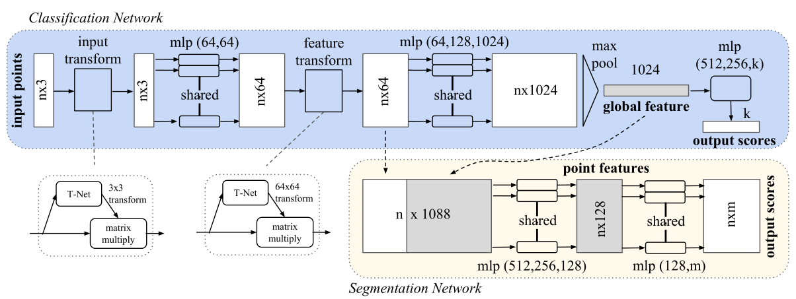

# PointNet: Deep Learning on Point Sets for 3D Classification and Segmentation

特点：直接对点云进行处理，

如图所示，**分类网络**对于输入的点云进行输入变换（input transform）和特征变换（feature transform），随后通过最大池化将特征整合在一起。**分割网络**则是分类网络的延伸，其将整体和局部特征连接在一起得出每个点的分数。图中中"mlp"代表"multi-layer perceptron"（多层感知机）。
 其中，mlp是通过共享权重的卷积实现的，第一层卷积核大小是1x3（因为每个点的维度是xyz），之后的每一层卷积核大小都是1x1。即特征提取层只是把每个点连接起来而已。经过两个空间变换网络和两个mlp之后，对每一个点提取1024维特征，经过maxpool变成1x1024的全局特征。再经过一个mlp（代码中运用全连接）得到k个score。分类网络最后接的loss是softmax。

# 网络特点

## 如何处理3D点云的无序输入？ 

​		答：构建对称函数；

**对称函数：**

- +与x是能处理两个输入的对称函数
- 点云排序是一个可能的对称函数

作者在这里构建了T-Net网络，学习一个获得3x3变换矩阵的函数，并对初始点云应用这个变换矩阵，这一部分被称为**输入变换**。随后通过一个mlp多层感知机后，再应用一次变换矩阵（**特征变换**）和多层感知机，最后进行一次最大池化。

以上阶段学习到的变换函数是如下图所表示的函数g和h，来保证了模型对特定空间转换的不变性。

理解：深度学习实际上是对复杂函数的拟合，g作为一个对称函数，是由单变量函数与最大池化实现的；h是mlp结构，代表了一个复杂函数（在图中是将一个3维向量映射成1024维向量的函数）。

## 如何处理点与点之间具有交互关系？

**答：整合局部和全局信息：**

对于点云分割任务，我们需要将局部跟全局信息结合起来。

经过特征变换后的信息称作局部信息，它们是与每一个点紧密相关的；我们将局部信息和全局信息简单地连接起来，就得到用于分割的全部信息。

# 参考

1. [PointNet：基于深度学习的3D点云分类和分割模型 详解](https://www.jianshu.com/p/6a0fc51187c1)
2. [Momenta高级研究员陈亮论文解读](https://links.jianshu.com/go?to=https%3A%2F%2Fwww.leiphone.com%2Fnews%2F201708%2FehaRP2W7JpF1jG0P.html)
3. [美团无人配送的知乎专栏：PointNet系列论文解读](https://links.jianshu.com/go?to=https%3A%2F%2Fzhuanlan.zhihu.com%2Fp%2F44809266)
4. [hitrjj的CSDN博客:三维点云网络——PointNet论文解读](https://links.jianshu.com/go?to=https%3A%2F%2Fblog.csdn.net%2Fu014636245%2Farticle%2Fdetails%2F82755966)
5. [github源码](https://links.jianshu.com/go?to=https%3A%2F%2Fgithub.com%2Fcharlesq34%2Fpointnet%2Fblob%2Fmaster%2F)
6. [痛并快乐着呦西的CSDN博客：三维深度学习之pointnet系列详解](https://links.jianshu.com/go?to=https%3A%2F%2Fblog.csdn.net%2Fqq_15332903%2Farticle%2Fdetails%2F80224387)

